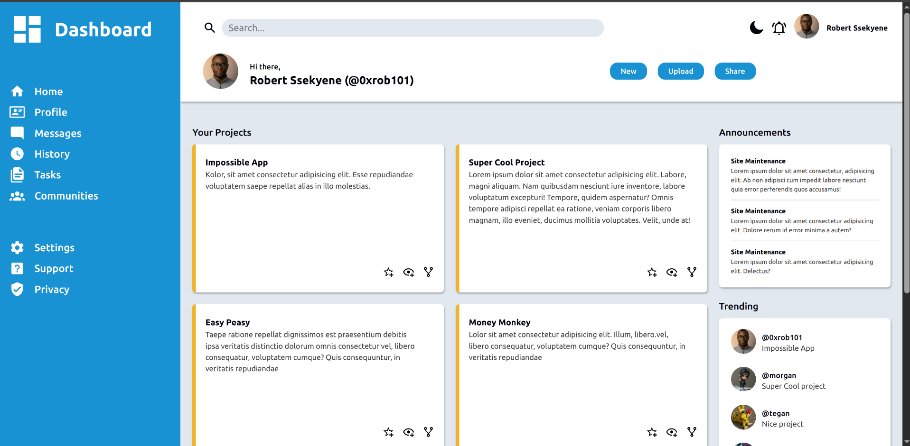
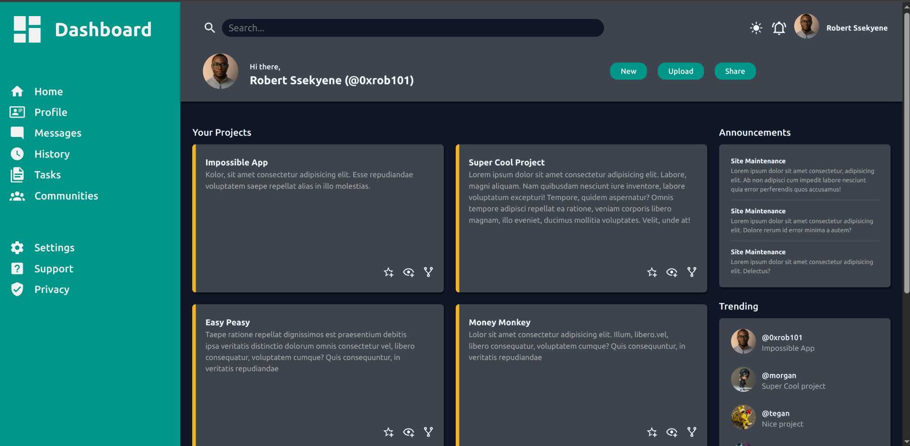

<h1 align=center>Admin Dashboard</h1>

  
  
  

<a href="https://ssekyene.github.io/admin-dashboard">Click here to preview</a>

<i>Light Theme</i>

<i>Dark Theme</i>

> More advaned and feature-rich version of this dashboard coming soon...

This dashboard is fundamentally built with an aim of practicing acquired CSS grid skills and also applying other CSS concepts like Flexbox, positions, pseudo-elements, etc. It is a simple admin dashboard layout with a light and dark theme toggle feature.

## Built with
-    
- 
- 

## Notes
- This is just a static layout and does not have any backend functionality.
- The theme toggle feature is implemented using JavaScript to switch between light and dark themes.
- It was tested on the latest versions of Chrome and Firefox However, it should work on other modern browsers as well.

## Remarks
- Feel free to clone and customize or enhance the dashboard as per your requirements.
- Contributions and suggestions are welcome 👍

## Acknowledgements
- [Pictogram icons](https://pictogrammers.com/) for the icons used in the dashboard.
- [TheOdinProject](https://www.theodinproject.com/) for the curriculum and guidance.